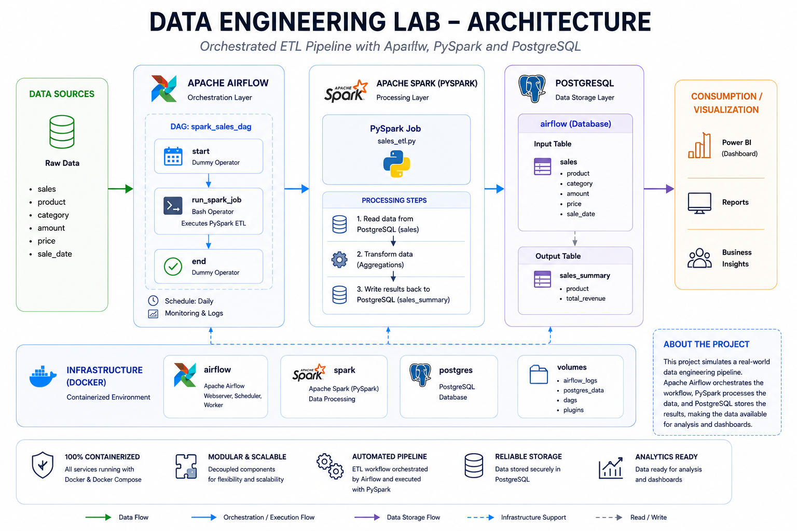

# Data Engineering Lab

Mini corporate-style Data Engineering environment using:

- Apache Airflow
- Apache Spark (PySpark)
- PostgreSQL
- Docker

## Architecture

Airflow orchestrates Spark jobs executed inside a dedicated Spark container.

Processed data can be stored in PostgreSQL.



## Stack

- Airflow
- PySpark
- PostgreSQL
- Docker Compose

## Project Structure

```bash
airflow/
spark/
docker-compose.yml